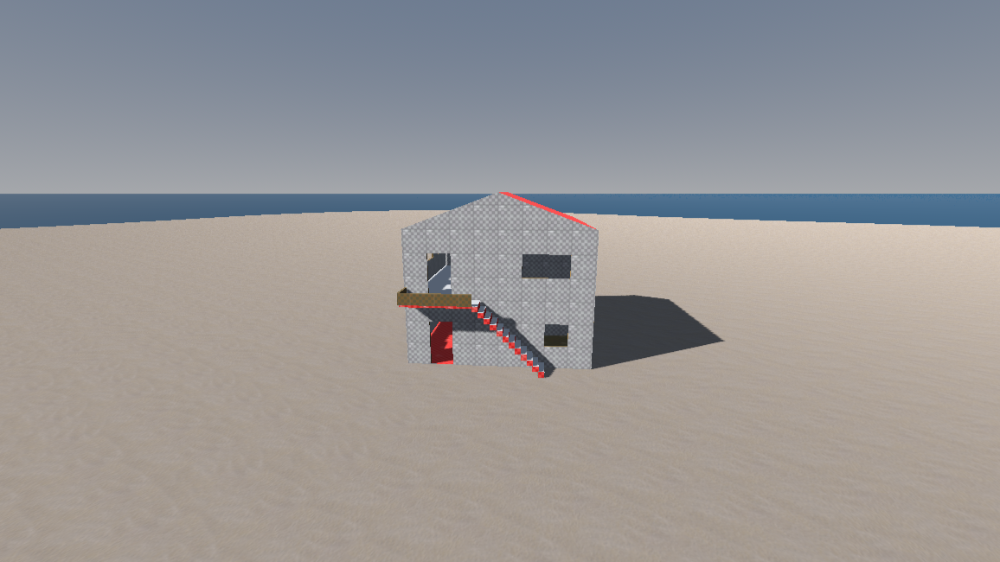
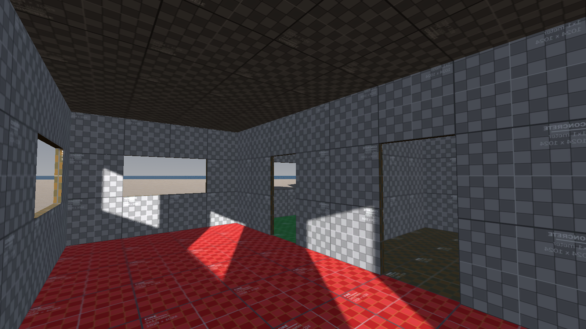
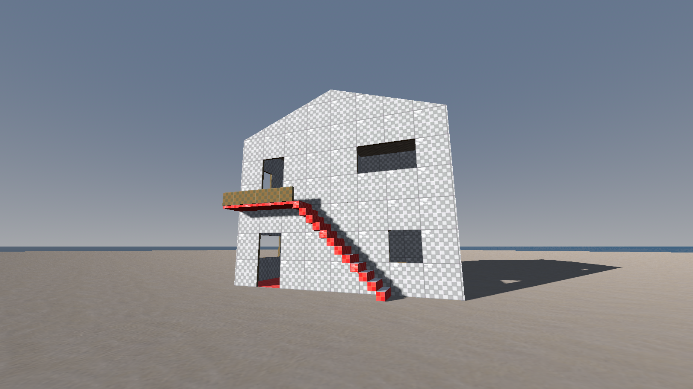
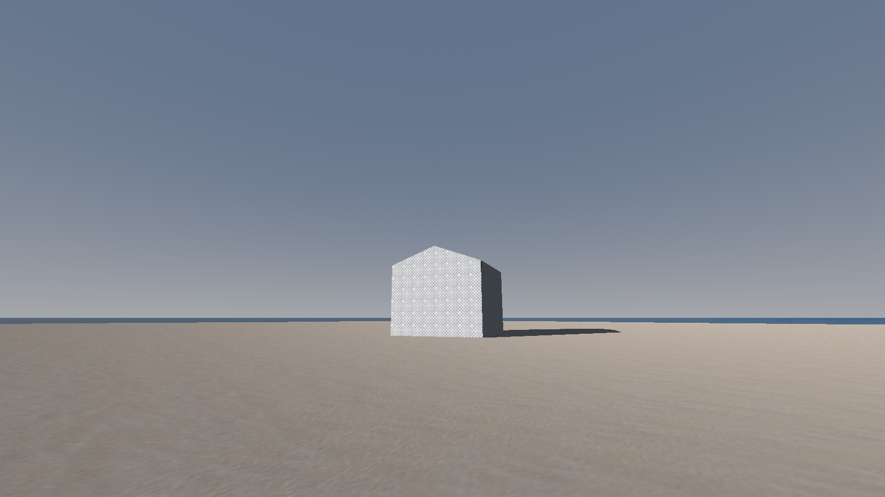
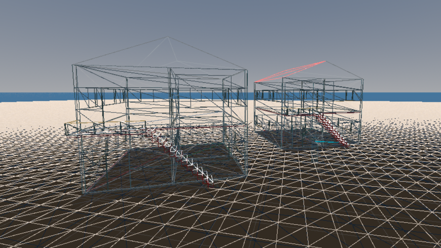
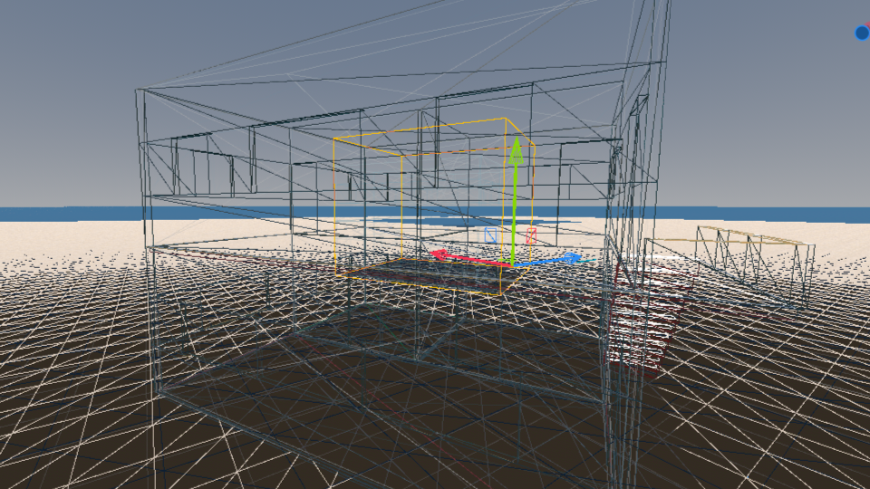

# Home Builder

A Godot 4 plugin (C#) for building structures directly in the scene editor by clicking in the 3D viewport.

## Requirements & Installation

Requires Godot 4.x with .NET (Mono) support. To install the plugin, copy the `addons` folder from this repository into your project's `addons` folder. Then enable it under **Project → Project Settings → Plugins**.



---

## Workflow

1. Open or create a 3D scene.
2. Activate a build mode in the **Home Builder** panel (bottom of the editor).
3. Build the structure floor by floor using the floor selector.
4. Once the building is ready, use **Bake** mode to export it as an optimised scene.
5. Instance the baked scene in your level.

---

## Build Modes

### Floors
Hold and drag in the viewport to fill a rectangle of tiles. A single click places a 1×1 m tile; dragging covers the whole room at once (a single `MeshInstance3D` for the entire rectangle, not one tile per cell). Snapping is to the 1 m grid. Configurable:
- **Thickness** of the slab
- Material for the **top face**, **bottom face**, and **sides**

### Walls
- First click: wall start point.
- Second click: wall end point. The wall automatically aligns to the centre of floor tiles.
- Intersections between walls (L, T, or X corners) are resolved automatically with mitre joints — no visible gaps at any angle.
- Walls support **doors and windows** (see below).
- Configurable: wall **height** and **thickness**, and materials for **face A**, **face B**, and **edges**.

### Doors & Windows
With Doors or Windows mode active, click on an existing wall to open a cutout. The gap is carved into both the wall geometry and its collision shape.
- Doors: configurable width and height.
- Windows: configurable width, height, and sill height.

### Stairs
- First click: staircase base.
- Second click: direction and length. The staircase connects the current floor to the one above.
- Configurable: number of steps, width, and depth (tread) of each step.
- **Step height** is calculated automatically as `wall height / number of steps`, so the staircase always meets the upper floor exactly. More steps make them shorter; fewer steps make them taller.

### Roofs
Hold and drag in the viewport to define the roof footprint on the active floor. Snapping is to half a tile (0.5 m) so the roof can align with wall outer faces, not just cell centres. The footprint is automatically extended outward by half the wall thickness on each side, so the roof reaches the exterior face of perimeter walls. Available types:
- **Flat**
- **Shed** — configurable: direction and pitch
- **Gable** — configurable: direction and pitch
- **Hip** — the ridge is automatically oriented along the longest side of the rectangle.

Every type is also configurable by **eave** and **thickness**, and none of them has a horizontal base.

**Eave** prolongs the slope faces outward past the footprint at the same pitch, so the roof overhangs the facade instead of dying flush with it. It is independent of width/depth/pitch: resize the roof with the gizmo and the same overhang is regenerated off the new edge. `0` gives the flush roof. Default is 0.4 m. On a gable it drives both the eave proper and the rake overhang over the gable ends; on a flat roof it simply widens the slab.

**Thickness** makes the roof a solid instead of a single-sided skin: the slope faces become the soffit you see from below, a second shell is raised above them, and a band around the perimeter closes the two. It is measured perpendicular to the slope, so the ridge ends up slightly higher than the value itself. Default is 0.2 m.

**No horizontal base** — the slopes are all there is — so the space below is yours to fill: leave the top storey's walls bare, add a floor slab and a staircase for an attic, or drop in a ceiling.

Material slots are outer skin / soffit / perimeter band. Shed and gable roofs additionally have **end walls** — the shed's back wall and side triangles, the gable's two ends — which are real solids and therefore get the same three slots a wall does: face A (outward), face B (inward) and edge. They sit at the footprint edge with the roof flying over them, so they line up with the walls below; their thickness is an inspector-only property on the node (`end_thickness`, default 0.1 m) since it should just match the walls rather than be tuned per roof. Flat and hip roofs have no end walls, so that whole row disappears from the panel and those properties are hidden in the Inspector.

### Fences / Railings
- First click: starting corner of the segment.
- Second click: ending corner. Modules are instantiated along the dominant axis (X or Z).
- Requires assigning a `PackedScene` as the fence asset in the panel.
- Configurable: **module size**. The asset is scaled in X to that length, so any native width works as long as the pivot is at the centre of the base and the asset faces +X.

> **Limitation**: fences only support axis-aligned placement (X or Z). Diagonal placement is not supported.

---

## Multiple Floors

The floor selector (▲ / ▼ next to the floor number) controls which level new elements are placed on. When moving up a floor, lower floors are automatically hidden in the editor to keep the workspace clean.

> Floor height equals the configured wall height.

---

## Bake (Optimised Export)

**Bake** mode generates a `.tscn` scene ready to use in a level. Open the bake panel and configure:

| Parameter               | Description                                                                 |
|-------------------------|-----------------------------------------------------------------------------|
| **Output folder**       | `res://` path where the `.tscn` is saved                                    |
| **LOD0 end distance**   | Maximum distance (metres) at which full geometry is shown                   |
| **LOD1 start distance** | Distance from which the simplified version is shown                         |
| **Fade**                | Transition mode between LOD0 and LOD1: `No fade` or `Self` (see below)     |

#### LOD Distances

Values of **80 m or above** are recommended so the LOD switch happens when the building is already small on screen and the player cannot notice the detail difference. Short distances make the switch clearly visible.

If LOD0 end and LOD1 start are close together (e.g. 80 m and 81 m), the transition window is minimal and the effect is nearly instantaneous.

#### Fade Modes

- **No fade** — the switch between LOD0 and LOD1 is instantaneous. No visual artefacts. Recommended when distance values are high enough for the change to go unnoticed.
- **Self** — a smooth transition is applied between both LODs. May produce visual artefacts if the building has interior geometry (stairs, interior elements) that becomes visible through the walls during the transition, since they turn semi-transparent. It may also interact with transparent materials in the scene (water, glass). Use it for predominantly exterior buildings or when the transition occurs at a sufficient distance.

### Contents of the Baked Scene

```
StaticBody3D  (building name)
├── LOD0           — full geometry, one surface per original material
├── LOD1           — simplified geometry, one draw call per material
├── Occluder       — OccluderInstance3D for occlusion culling
├── Collision      — ConcavePolygonShape3D (walls, floor, roof)
└── Staircase_N    — ConvexPolygonShape3D per staircase
```

**LOD0 / LOD1** uses Godot's native `VisibilityRange` system. At distance, stairs, fences, and floors are removed from LOD1 to reduce polygon count, and walls are simplified to flat faces without openings.

**Occluder** allows Godot to cull objects hidden behind the building without rendering them. To enable it, activate it in your project:
> `Project Settings → Rendering → Occlusion Culling → Use Occlusion Culling = ON`
>
> To visualise occluders in the editor: `Debug → Visible Occlusion Culling Debug`

**Collision** is a single `ConcavePolygonShape3D` built from the visual geometry, so door and window openings are real collision cutouts. Stairs are kept as independent `ConvexPolygonShape3D` shapes so `CharacterBody3D` can climb them correctly via `move_and_slide`.

---

## Materials

Each mode exposes material selectors in the panel. Materials are assigned before placing elements; already-placed elements are not affected when the active material changes. Materials are preserved in the bake and simplified in LOD1 (normal maps, AO, and roughness maps are removed to reduce cost at distance).

---

## Sample Images

### Interiors


---

### LOD0 and LOD1



---

### Occlusion Culling


